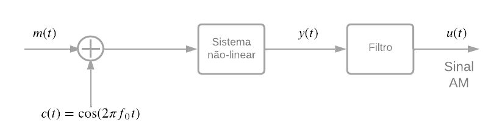

<!-- _class: lead -->

# Resolução Questões AM
Prof. Daniel Costa Araújo

---

## Questão 1

Considere sistema DSB cuja a portadora é dada por $c(t) = A \cos(2\pi f_c t)$ e a mensagem é $m(t) = \text{sinc}(t) + \text{sinc}(t)^2$. Determine a representação em frequência e a largura de banda do sinal modulado.

---
## Resolução 

Considere 
$$
\begin{align*}
 u(t) &= m(t)c(t) \\
      &=A\left(\text{sinc}(t) + \text{sinc}(t)^2 \right)   \cos(2\pi f_c t) \\
U(f) & = \frac{A}{2} \left[ \Pi (f)  + \Delta (f)\right]  \star  \left(\delta (f-f_c) + \delta (f+f_c) \right) \\
      &= \frac{A}{2} \left[ \Pi (f-f_c)  +  \Delta (f - f_c) +  \Pi (f+f_c)  +  \Delta (f + f_c)\right]
\end{align*}
$$
---
## Resolução 
A função $\Pi (f-f_c) \neq 0$ para $|f-f_c|<1/2$ e  $\Delta (f-f_c) \neq 0$ para $|f-f_c|<1$. Assim, a largura de banda do sinal de banda passante será de 2 Hz

---
## Questão 2

Considere o sinal $m(t)$
$$
m(t) = 2\cos(4000\pi t) + 5\cos(6000\pi t),
$$
o qual modula a portadora $c(t) = 100\cos(2\pi f_c t)$, em que $f_c = 50$ kHz. Determine and desenhe o espectro do sinal DSB-SC

---
## Resolução 
Considere $f_1= 2$ kHz e $f_2= 3$ kHz
$$
\begin{align*}
  u(t) & =  2\cos(2\pi f_1 t)\cos(2\pi f_c t) + 5\cos(2\pi f_2 t)\cos(2\pi f_c t)  \text{ Aplicando Fourier ...}  \\ 
  U(f) & = \left[\delta (f - f_1) + \delta (f + f_1) + \frac{5}{2}\delta (f - f_1) + \frac{5}{2}\delta (f + f_1)\right] \star \frac{100
  }{2}\left[ \delta (f - f_c) + \delta (f + f_c)\right] \\
     & =  \frac{100}{2}\left[\delta (f - f_1 - fc)  + \delta (f + f_1 - fc) + \frac{5}{2}\delta (f - f_1 - fc) + \frac{5}{2}\delta (f + f_1 - fc)\right] + \\
     & \frac{100}{2}\left[\delta (f - f_1 + fc)  + \delta (f + f_1 + fc) + \frac{5}{2}\delta (f - f_1 + fc) + \frac{5}{2}\delta (f + f_1 + fc)\right] 
\end{align*}
$$

---
## Continuação 
Portanto as componentes de frequência serão 

* $f_c - f_1 = 50  - 2 = 48$ kHz 
* $f_c - f_2 = 50  - 3 = 47$ kHz 
* $f_c + f_1 = 50  + 2 = 52$ kHz 
* $f_c + f_2 = 50  + 4 = 53$ kHz 

---

## Questão 3

O sinal de saída de um modulador AM é dado por

$$
u(t) = 5\cos(1800\pi t) + 20\cos(2000\pi t) + 5\cos(2200 \pi t).
$$

1. Determine o sinal $m(t)$  e a portadora $c(t)$
2. Determine o índice de modulação
3. Determine o razão entre a potência das bandas laterais e a potência da portadora
---

## Resolução

* Item 1

    $$
    \begin{align*}
        u(t) &= 5\cos(1800\pi t) + 20\cos(2000\pi t) + 5\cos(2200 \pi t) \\
            &= 20\left( 1 + \frac{1}{4}\cos(200\pi t) \right)\cos(2000\pi t) 
    \end{align*}
    $$

    A mensagem $m(t) = \frac{1}{2}\cos(200\pi t)$ e a portadora  $c(t) = 20\cos(2000\pi t)$

--- 
## Resolução

* item 2
    * O índice de modulação é dado por  $\alpha = \frac{1}{2}$

* item 3
    * Potência da portadora : $P_c = \frac{ 400}{2}$
    * Potência das bandas laterais: $P_l = \frac{400 \alpha ^2}{2}$
    * $$
        \frac{P_l}{P_c} = \alpha ^2 = \frac{1}{8}
      $$

---

## Questão 4

Um sinal SSB-AM é gerado com uma portadora operando a 800 KHz com uma mensagem $m(t) = \cos(2000\pi t) + 2 \sin(2000\pi t)$. A amplitude da portadora é $A_c = 100$.

1. Determine o sinal $\hat{m}(t)$
2. Determine a expressão SSB-AM de banda inferior
3. Determine o espectro SSB-AM de banda inferior

--- 
## Resolução   Item 1

  
$$
\begin{align*}
m(t)       & = \cos(2000\pi t) + 2 \sin(2000\pi t) \\
\hat{m}(t) & = \sin(2000\pi t) - 2 \cos(2000\pi t)
\end{align*}
$$

--- 

## Resolução  Item 2

$$
\begin{align*}
u_l(t)   & = 100 m(t)\cos(2\pi f_c t) + 100 \hat{m}(t) \sin(2\pi f_c t)\\ 
        & = 100 \left[ \cos(2000\pi t) + 2 \sin(2000\pi t) \right]\cos(2\pi f_c t) \\
        &  + 100 \left[ \sin(2000\pi t) - 2 \cos(2000\pi t) \right]\sin(2\pi f_c t) \\
        & = 100 \left[ \cos(2000\pi t)\cos(2\pi f_c t) + \sin(2000\pi t)\sin(2\pi f_c t) \right] \\
        & + 200 \left[ \sin(2000\pi t)\cos(2\pi f_c t) -  \cos(2000\pi t)\sin(2\pi f_c t) \right] \\
        & = 100 \cos(2\pi (f_c - 1000) t) - 200 \sin(2\pi (f_c - 1000) t)
\end{align*}
$$

---
## Resolução Item 3

 $$
    \begin{align*}
    u_l(t)   & = 100 \cos(2\pi (f_c - 1000) t) - 200 \sin(2\pi (f_c - 1000) t) \\
    U_l(f)   & = \frac{100}{2} \left( \delta (f - f_c + 1000 ) + \delta (f + f_c - 1000 )\right) \\
        & + \frac{200 \jmath}{2}\left( \delta (f - f_c + 1000 ) - \delta (f + f_c - 1000 )\right)  \\
        & = 50 \left( \delta (f - f_c + 1000 ) + \delta (f + f_c - 1000 )\right) \\
        & + 100\jmath \left( \delta (f - f_c + 1000 ) - \delta (f + f_c - 1000 )\right) \\
        & = (50 + 100\jmath)\delta (f - f_c + 1000 ) +  (50 - 100\jmath)\delta (f + f_c - 1000 )
    \end{align*}
  $$

---

A magnitude do espectro 

$$
\begin{align*}
|U_l(f)| &= \sqrt{50^2 + 100^2} \left( \delta (f - f_c + 1000 ) + \delta (f + f_c - 1000 ) \right) \\
        &= 10\sqrt{125} \left( \delta (f - f_c + 1000 ) + \delta (f + f_c - 1000 ) \right) \\    
\end{align*}
$$

---

## Questão 5

Demonstre que o envelope de banda-passante de modulação AM-DSB-SC é proporcional ao valor absoluto da mensagem $m(t)$. Se isso é verdade como é possível explorar essa propriedade na recepção ?

---

## Resolução

* 
  $$
   \begin{align*}
   u(t) & = m(t)\cos(2 \pi f_c t  + \phi) \\
        & = m(t)\cos(\phi)\cos(2 \pi f_c t) - m(t)\sin(\phi)\sin(2 \pi f_c t) \\
        & = u_i(t)\cos(2 \pi f_c t) - u_q(t)\sin(2 \pi f_c t)
   \end{align*}
   $$
* 
  $$
  \begin{align*}
  V_u(t) & = \sqrt{u^2_i(t) + u^2_q(t)} \\
         & = \sqrt{m^2(t)\cos^2(\phi) + m^2(t)\sin^2(\phi)} \\
         & = m(t)\sqrt{\cos^2(\phi) + \sin^2(\phi)} \\
         & = \sqrt{m^2(t)} = |m(t)| 
  \end{align*}
  $$

--- 
<!-- _class: lead -->
# Arquiteturas de moduladores AM

---
## Questão 6

O sistema mostrado na figura é utilizado para gerar um sinal AM. O sinal modulado $m(t)$ possui média zero e valor absoluto máximo de $A_m = \max |m(t)|$. O dispositivo não-linear possui características de entrada e saída dada por

$$
y(t) = ax(t) + b x^2(t)
$$

1. Mostre a expressão de $y(t)$ em termos da mensagem e da portadora
2.  Especificar as características do filtro que resultariam em sinal AM na sua saída.
3. Qual índice de modulação?

---
## Arquitetura de transmissão

---

## Resolução
* Item 1
    $$
    \begin{align*}
        y(t) &= ax(t) + b x^2(t) \\
            & =  a(m(t) + \cos(2\pi f_ct)) + b(m(t) + \cos(2\pi f_ct))^2 \\
            & = am(t) + bm^2(t) + a\cos(2\pi f_ct)) + 2bm(t)\cos(2\pi f_ct) + b\cos^2(2\pi f_ct)\\
            & = a(1 + \frac{2b}{a}m(t))\cos(2\pi f_ct) + \left(am(t) + bm^2(t) + b\cos^2(2\pi f_ct)\right)
    \end{align*}
    $$

* Item 2
    O filtro deve selecionar o sinal $a(1 + \frac{2b}{a}m(t))\cos(2\pi f_ct)$ e filtrar todas as outras componentes. Portanto o filtro deve ser um seletor de faixa centrado em $f_c$ e largura de banda 2B, em que seria a largura de banda do sinal. 

---

* Item 3 
     $$
    \begin{align*}
        y(t) &= a(1 + \frac{2b}{a}m(t))\cos(2\pi f_ct) \\
             &= a(1 + \frac{2bA_m}{a}m_n(t))\cos(2\pi f_ct) \\
             &= a(1 + \alpha m_n(t))\cos(2\pi f_ct)
    \end{align*}
    $$
    em que $m_n(t)$ é a mensagem normalizada. O índice de modulação é igual a

    $$
    \alpha = \frac{2bA_m}{a}
    $$

---
## Questão 7

