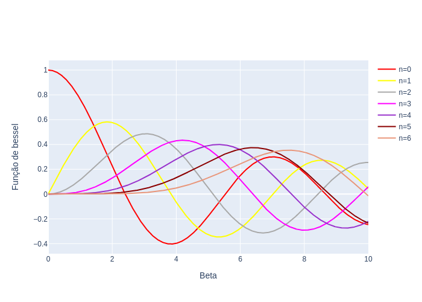

<!-- _class: lead -->

# Modulação FM

Prof. Daniel Costa Araújo

---
<!-- _class: lead -->
# Modelo de Sinal

---

## Conceito

---

---

## O que é frequência ?

Em uma definição geral, a frequência é taxa de variação com que a fase do sinal varia ao longo do tempo

$$
f_i(t) = f_c + \frac{1}{2\pi}\frac{d}{dt} \phi (t)
$$

---

## Conceito

Considere o sinal de banda-passante

$$
u(t) = A_c \cos (2\pi f_c t + \phi (t))
$$

Há duas maneiras de alteramos a fase do sinal

1. Modulação PM  $\rightarrow$ $\phi(t) = k_p m(t)$

---

2. Modulação FM
    $$
    \begin{align*}
    f_i(t) - f_c & = k_f m(t) \\
    f_i(t) - f_c & = \frac{1}{2\pi}\frac{d}{dt} \phi (t) \\
    \frac{d}{dt} \phi (t) & = 2\pi k_f m(t) \\
    \phi (t) & = 2\pi k_f \int_{-\infty}^{t} m(\tau) d\tau \\
    \end{align*}
    $$

---

## Representação em fase e frequência

1. Fase do sinal de banda-passante
   $$
   \phi (t) = \begin{cases}
    k_p m(t), & PM \\
    2\pi k_f \int_{-\infty}^{t} m(\tau) d\tau , & FM \\
   \end{cases}
   $$

2. Frequência do sinal de banda passante
   $$
   \frac{1}{2\pi}\frac{d}{dt} \phi (t) = \begin{cases}
    k_p\frac{1}{2\pi} \frac{d}{dt} m(t), & PM \\
    k_f  m(t)  , & FM \\
   \end{cases}
   $$

---

## Desvio de fase e frequência

1. Modulação PM
    1. Desvio máximo de fase $\Delta \phi _{max} = k_p \max {|m(t)|}$
2. Modulção FM
    1. Desvio máximo de frequência  $\Delta f _{max} = k_p \max {|m(t)|}$

---

## Equivalências

* Modulador FM = Integrador + Modulador PM
* Modulador PM = Derivador + Modulador FM

---

## Índice de Modulação

Considere a mensagem $m(t)$

$$
m(t) = a \cos (2\pi f_m t)
$$

Utilize-a para obter a expressão do sinal modulado em frequência e

$$
\begin{align*}
\phi (t) &= k_p a \cos (2\pi f_m t), \,\ \text{Sinal PM} \\
\phi (t) &= 2\pi k_f \int_{-\infty}^{t} m(\tau)  d\tau =  \frac{a k_f }{f_m}\sin (2\pi f_m t), \,\ \text{Sinal FM} \\
\end{align*}
$$

---

* O índice de modulação para o sinal FM é
    $$
    \beta _p = k_p a
    $$

* O índice de modulação para o sinal PM é
    $$
    \begin{align*}
    \beta _f &=  \frac{a k_f }{f_m}  \\
            &=  \frac{\Delta f_{max} }{f_m}  \\  
    \end{align*}
    $$

---

## Exemplo

Considere o sinal $m(t)$ usado para modular em frequência.

* Encontre a relação entre $k_p$ e $k_f$, tal que o máximo desvio de fase de ambos o sinais sejam iguais.
* Se $k_p = k_f = 1$ qual a máxima frequência instantânea em cada caso?

---

---

## Solução

Sinal PM

$$
\Delta \phi _{\text{max}} = k_p \max \{|m(t)|\} =k_p
$$

Sinal FM

$$ \phi(t) = 2\pi k_f \int _{-\infty}^{t}m(\tau)d\tau = \begin{cases}
\pi k_f t^2, & 0 \leq t < 1 \\
\pi k_f  + 2\pi k_f (t-1),&   1 \leq t < 2 \\
3\pi k_f  - 2\pi k_f (t-2),&   2 \leq t < 3 \\
\pi k_f,&    t \geq 3 \\
\end{cases}
$$

$$
\Delta \phi _{\text{max}} = \phi (t=2)=3\pi k_f
$$

---
Portanto:

$$
k_p = 3\pi k_f
$$

Para o cálculo da frequência máxima do sinal PM tem-se:

$$
\begin{align*}
f_i(t) & = f_c + \frac{1}{2\pi} \frac{d}{dt}\phi(t) \\
& = f_c + \frac{1}{2\pi} k_p\frac{d}{dt}m(t) \\
& = f_c + \frac{k_p}{2\pi} \left[ g(t)  - 2 \delta (t-2) + \delta(t-3)\right]
\end{align*}
$$
em que $g(t) = u(t) - u(t-1)$, sendo $u(t)$ a função degrau.

---

Para o sinal FM

$$
\begin{align*}
f_{\text{max}} & = \max \left[ f_c + k_fm(t) \right]\\
f_{\text{max}}& = f_c + k_f \\
 & = f_c + 1
\end{align*}
$$

---

## Modulação de banda-estreita

$$
\begin{align*}
    u(t) & = A_c \cos(2\pi f_c t) \cos \phi(t) -  A_c \sin(2\pi f_c t) \sin \phi(t)  \\
         & \approx A_c \cos(2\pi f_c t) - A_c \phi(t) \sin 2\pi f_c t
\end{align*}
$$

---
<!-- _class: lead -->
# Caracterização Espectral

---

## Modulação em fase (frequência) com sinal senoidais

Considere um sinal modulado em fase:

$$
\begin{align*}
u(t) & = A_c \cos(2\pi f_ct + \beta 2\pi f_m t)    \\
     & = \textrm{Re}\left(m(t)e^{\jmath 2\pi f_c t}\right) \\
     & = \textrm{Re}\left(A_c e^{\jmath \beta \sin (2\pi f_m t)}e^{\jmath 2\pi f_c t}\right)
\end{align*}
$$

O sinal $m(t)$ é a componente de banda básica e periódica. Portanto, é possível analisá-lo em frequência pela transformada Fourier

$$
e^{\jmath \beta 2\pi f_m t} = \sum _{n = -\infty}^{\infty}c_n e^{\jmath 2\pi nf_m t}
$$

---
 Calculando os coeficientes da série

$$
\begin{align*}
    c_n &= \frac{1}{T_m} \int _{0}^{T_m} e^{\jmath \beta \sin (2\pi f_m t)}e^{-\jmath 2\pi n f_m t} sf \\
        &= \frac{1}{2\pi} \int _{0}^{2\pi} e^{\jmath (\beta \sin u - nu)} du, \,\ u = 2\pi f_m t \\
        & = J_n(\beta)
\end{align*}
$$
$J_n(\beta)$ é a função de Bessel do Primeiro tipo e ordem n

---
Subsituindo a série de Fourier no sinal original

$$
\begin{align*}
    u(t) &= \textrm{Re}\left(A_c e^{\jmath \beta \sin (2\pi f_m t)}e^{\jmath 2\pi f_c t}\right)  \\
        &= \textrm{Re}\left(A_c  \sum _{n = -\infty}^{\infty}c_n e^{\jmath 2\pi nfm t}e^{\jmath 2\pi f_c t}\right) \\
        &= \textrm{Re}\left(A_c  \sum _{n = -\infty}^{\infty}J_n(\beta)e^{\jmath 2\pi (f_c + nf_m) t}\right) \\
        &= A_c \sum _{n = -\infty}^{\infty} J_n(\beta)\cos (2\pi (f_c + nf_m) t)
\end{align*}
$$

---
## Função de Bessel

---

## Análise da das harmônicas

* Exemplo

    |Potência (\%) | $\beta = 0.5$ | $\beta = 1$ | $\beta = 2$ | $\beta = 5$ |$\beta = 8$ |
    |---|  ---| ---|---|---| --|
    80 |  | 1 | 2 | 4 |7|
    90 | 1| 1 | 2 | 5 |8|
    98 | 1| 2 | 3 | 6 |9|

---

## Exemplo

Considere um mensagem $m(t)=\cos(20\pi t)$ modulando em frequência a portadora $c(t) = 10\cos(2\pi f_c t)$. Considere um desvio de frequênmcia $k_f = 50$. Determine a expressão do sinal modulado e quantas harmônicas  devem ser consideradas para conter $99%$ da energia do sinal modulado.

---

## Solução

A potência total é dada por $P_c = \frac{A_c^2}{2} = 50$

O sinal modulado é dado por
$$
\begin{align*}
    u(t) &= 10 \cos(2\pi f_ct + 2\pi k_f \int _{-\infty}^{t}\cos(20\pi \tau)d\tau) \\
    &= 10 \cos(2\pi f_ct + \frac{2\pi k_f}{20\pi}\sin(20\pi \tau)d\tau)  \\
    &= 10 \cos(2\pi f_ct + 5\sin(20\pi \tau)d\tau)
\end{align*}
$$

O índice de modulação do sinal é dado por $\beta = \frac{k_f \max|m(t)|}{f_m} = 5$

---

O sinal modulado é, portanto:

$$
\begin{align*}
    u(t) &= 10 \sum _{n = -\infty}^{\infty} J_n(5)\cos (2\pi (f_c + n10) t)
\end{align*}
$$

Considerando o cálculo das potências de cada componente de frequência tem-se que:

$$
\sum_{n=-k}^{k} 50 J^2_n(5) \geq  0.99 * 50
$$
Numericamente, o valor de $k = 6$

Portanto a largura de banda do sinal FM é de 120 Hz.

---

## Cálculo da banda efetiva

O espectro pode ser representado como

Para o cálculo de 98% da potência do sinal temos a aproximação

$$
B_c = 2 (\beta + 1) f_m
$$

---

## Banda Efetiva PM e FM em Sinais Senoidais

$$
\begin{align*}
    B_c     &= 2 (\beta + 1)f_m \\
    B_{PM}  &= 2 (k_p a +1) f_m, \,\, \beta _{p} = k_pa \\
    B_{FM}  &= 2 (\frac{k_f a}{f_m} +1) f_m, \,\, \beta _{f} =\frac{k_f a}{f_m}
\end{align*}
$$

Portanto

$$
B_c = \begin{cases}
    2 (k_p a +1) f_m, & \text{FM} \\
    2 (k_f a +f_m) f_m, & \text{FM}
\end{cases}
$$

---

## Conclusões importantes

1. Aumentar a amplitude possui efeito similares em FM e PM \\
2. Aumentar a frequência da mensagem implica em aumentar a banda FM e PM
   1. FM: aumento aditivo
   2. PM: aumento proporcional.

---

## Cálculo do Número de  Harmônicas

Para estimar o número de harmônicas, tem-se
$$
M_c = 2(\lfloor{ \beta}\rfloor + 1) + 1 = \begin{cases}
    2\lfloor{ k_pa}\rfloor + 3, & \textrm{PM} \\
    2\lfloor{ \frac{k_fa}{f_m}}\rfloor + 3, & \textrm{FM}
\end{cases}
$$

* IMPORTANTe
  * (PM) : aumento de $f_m$ não aumenta o número de harmônicas
  * (FM ): aumento de $f_m$ reduz o número de harmônicas

---

## Regra de Cason

Define a largura de banda efetiva para um sinal mensagem qualquer

$$
B_c = 2(\beta + 1) W = \begin{cases}
    k_p \max|m(t)|, & \text{PM}\\
    \frac{k_f \max|m(t)|}{W}, & \text{PM}
\end{cases}
$$

---

## Exemplo

Para um sinal modulado em Fm com mensagem $m(t) = 10\text{sinc}(10^4t)$, determine a largura de banda do sinal transmitido com $k_f=4000$

---

## Solução

A transformada de Fourier da mensagem é
$$
M(f) = \frac{1}{B} \Pi \left(\frac{f}{B}\right),
$$
em que, $B = 10$ kHz, portanto a largura de banda da mensagem é $W=5$ kHz. O índice de modulação é portatno:

$$
\begin{align*}
    \beta &= \frac{k_f \max|m(t)|}{W} \\
          &= \frac{4000 10}{5000} \\
          &= 8
\end{align*}
$$

---
A largura de banda da mensagem é dada por:

$$
\begin{align*}
    B_c &= 2(8+1) 5000 \\
        &= 90 \text{kHz}
\end{align*}
$$

---

<!-- _class: lead -->
# Implementação de Moduladores e Demoduladures  FM

---

## Modulador utilizando um circuito oscilador

A frequência de oscilação desse circuito é dada port

$$
\begin{align*}
    f_i(t) & = \frac{1}{\pi\sqrt{L_0 \left(C_0 + k_0m(t) \right)}} \\
            & =  \frac{1}{2\pi\sqrt{L_0 C_0 }}\frac{1}{\sqrt{1 + \frac{k_0}{C_0}m(t)}} \\
            & = f_c \frac{1}{\sqrt{1 + \frac{k_0}{C_0}m(t)}}
\end{align*}
$$

---

Considerando que

$$
\frac{1}{\sqrt{1+\epsilon} } \approx 1 - \frac{\epsilon}{2}
$$
Utilizando essa aproximação, tem-se que
$$
f_i(t) = f_c \left(1 - \frac{k_0}{2C_0}m(t)\right)
$$

---

## FM de banda-estreita

Esse tipo de modulador explora a aproximação de banda estreita para um sinal AM

$$
\begin{align*}
    u(t) & = A_c \cos \phi (t) \cos 2\pi f_c t -  A_c \sin \phi (t) \sin 2\pi f_c t \\
          & \approx A_c  \cos 2\pi f_c t -  A_c \phi(t) \sin 2\pi f_c t
\end{align*}
$$

* Estrutura similar ao modulador AM
* Fácil adaptação

---

## Geração Indireta do Sinal Angular

Caracaterizado por um gerador de sinal FM de banda-estreita concatenado com multiplicadores de frequência.

---

## Demodulador FM

Uso do derivador para extrair a informação da fase

$$
\begin{align*}
    \dot{\phi} (t) & = \frac{\partial}{\partial t} \left[A \cos \left( 2\pi f_c t + k_f \int _{-\infty}^{t} m(\tau)d\tau \right) \right] \\
                 & = A_c \left[2\pi f_c + k_f m(t) \right]A \sin \left( 2\pi f_c t + k_f \int _{-\infty}^{t} m(\tau)d\tau - \pi \right)
\end{align*}
$$

* Importante
  * Note que o termo $\left[2\pi f_c + k_f m(t) \right]$ esta na amlitude da portadora
  * Sinal AM portanto um detector de envelope pode ser utilizado para a demodulação.

---

## Filtro de demodulação

---

## Discriminador equilibrado

---

## Implementação

